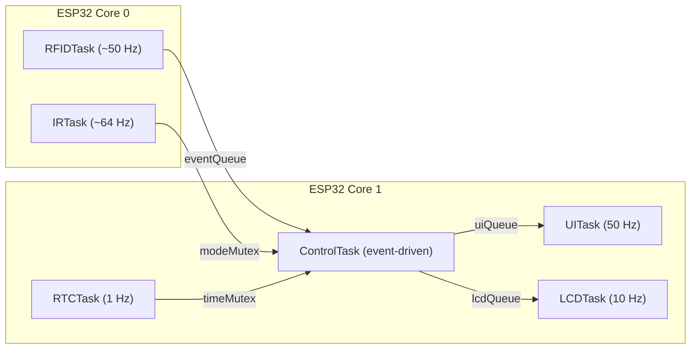

# Smart RFID Door Lock — ESP32 + FreeRTOS

A real-time, multitasking access-control system built on the ESP32, combining RFID authentication, time-based access rules, and a remote-selectable operating mode — all running across six FreeRTOS tasks split between the chip's two cores.

[](https://www.youtube.com/watch?v=7aLUuD_k7PM)

*Click the thumbnail above to watch the project demo on YouTube.*

## Overview

This project implements a smart door-lock controller that grants or denies access based on:

- **Identity** — the UID of a scanned RFID card, checked against an authorized UID
- **Time** — the current time read from a battery-backed DS3231 real-time clock
- **Mode** — one of three operating modes selected live via an IR remote

Access decisions are communicated instantly through a green/red LED, a buzzer tone, and a 16x2 I2C LCD, while all six FreeRTOS tasks run concurrently and communicate safely through queues and mutexes across both ESP32 cores.

## Features

- **RFID authentication** via an MFRC522 reader over SPI, with UID matching and a scan cooldown to prevent duplicate triggers
- **Time-based access control** using a DS3231 RTC over I2C (office-hours window: 9 AM–5 PM)
- **Three selectable modes** via an IR remote (NEC protocol): Office Hours, Locked, and Free
- **Real-time multitasking** — six FreeRTOS tasks pinned across Core 0 and Core 1, synchronized with queues and mutexes
- **Instant feedback** — grant/deny LEDs, distinct buzzer tones, and a live-updating LCD status display
- **Auto-generated API documentation** via Doxygen

## Skills & Concepts Demonstrated

**Languages**
C / C++ (Arduino/embedded C++)

**Platforms & Frameworks**
Arduino core for ESP32 · FreeRTOS

**RTOS & Concurrency Concepts**
Preemptive priority-based scheduling · dual-core task pinning (`xTaskCreatePinnedToCore`) · inter-task communication via queues (`xQueueSend`/`xQueueReceive`) · mutex-protected shared state (`xSemaphoreTake`/`xSemaphoreGive`) · tick-based periodic scheduling (`vTaskDelayUntil`) · event-driven task design · watchdog timer configuration

**Communication Protocols**
SPI · I2C · UART/Serial · IR remote control (NEC protocol)

**Embedded Systems Concepts**
Real-time system design · debounce/cooldown logic · state machines (operating modes) · time-based access-control logic · hardware abstraction via device driver libraries · polling vs. interrupt-driven I/O tradeoffs · resource-constrained programming (fixed-size buffers, static allocation)

**Tools**
Arduino IDE · Doxygen (API documentation generation) · Git/GitHub · serial console debugging

**Engineering Practice**
Modular task decomposition · hardware/software integration testing · technical documentation and report writing · Doxygen-style code documentation

## System Architecture



| Task | Core | Rate | Responsibility |
|---|---|---|---|
| `RFIDTask` | 0 | ~50 Hz | Polls the RC522 for a new card, reads and validates the UID, applies a scan cooldown, sends `EventMsg` to `ControlTask` |
| `IRTask` | 0 | ~64 Hz | Decodes NEC IR frames, maps command bytes to operating modes, updates the shared mode under `modeMutex` |
| `RTCTask` | 1 | 1 Hz | Reads the DS3231, updates shared time state under `timeMutex` |
| `ControlTask` | 1 | Event-driven | Blocks on `eventQueue`; combines UID match, time-of-day, and mode to decide grant/deny; fans the result out to `uiQueue` and `lcdQueue` |
| `UITask` | 1 | 50 Hz | Drains `uiQueue`; drives the grant/deny LEDs and buzzer tones |
| `LCDTask` | 1 | 10 Hz | Drains `lcdQueue`; renders mode, scan result, and RFID-readiness on the LCD |

## Access Control Logic

| Mode | Behavior |
|---|---|
| **Office Hours** | Grants access only when the scanned UID matches the authorized card **and** the current time is within 9 AM–5 PM |
| **Locked** | Always denies access, regardless of card or time |
| **Free** | Always grants access to any scanned card |

## Hardware

| Component | Interface | Role |
|---|---|---|
| ESP32-S3 | — | Dual-core microcontroller running FreeRTOS, orchestrates all tasks |
| MFRC522 RFID reader | SPI | Reads card UIDs for authentication |
| DS3231 RTC module | I2C | Provides accurate real-time timekeeping for office-hours enforcement |
| IR receiver + remote | Digital GPIO (NEC protocol) | Switches between Office / Locked / Free modes |
| 16x2 I2C LCD (PCF8574 backpack) | I2C | Displays current mode and scan results |
| Green + red LEDs | Digital GPIO | Visual grant/deny indicator |
| Piezo buzzer | PWM (`tone()`) | Audible grant (high tone) / deny (low tone) indicator |

### Pinout

| Signal | GPIO |
|---|---|
| RFID SS (Slave Select) | 10 |
| RFID RST | 9 |
| SPI SCK | 12 |
| SPI MISO | 13 |
| SPI MOSI | 11 |
| I2C SDA (RTC + LCD) | 21 |
| I2C SCL (RTC + LCD) | 47 |
| Green LED (access granted) | 6 |
| Red LED (access denied) | 7 |
| Buzzer | 8 |
| IR receiver data | 4 |

## Getting Started

### Hardware needed
ESP32-S3 dev board, MFRC522 RFID reader + tags, DS3231 RTC module, IR receiver + remote, 16x2 I2C LCD, 2x LEDs (+ resistors), piezo buzzer, breadboard and jumper wires.

### 1. Install board support
In the Arduino IDE, add the ESP32 boards package via **File → Preferences → Additional Board Manager URLs**:
```
https://raw.githubusercontent.com/espressif/arduino-esp32/gh-pages/package_esp32_index.json
```
Then install **esp32 by Espressif Systems** from the Boards Manager, and select an ESP32-S3 board.

### 2. Install required libraries
Via **Sketch → Include Library → Manage Libraries**, install:
- `MFRC522`
- `RTClib`
- `IRremote`
- `LiquidCrystal_I2C`

(`Arduino.h`, `SPI.h`, and `Wire.h` ship with the core.)

### 3. Wire the hardware
Connect each component to the GPIOs listed in [Pinout](#pinout) above.

### 4. Set your authorized card UID
Edit the `allowedUID` array in [`src/SmartRFIDDoorLock/SmartRFIDDoorLock.ino`](src/SmartRFIDDoorLock/SmartRFIDDoorLock.ino) to match your RFID tag's UID (print it via `Serial` on first scan).

### 5. Upload and run
Open `src/SmartRFIDDoorLock/SmartRFIDDoorLock.ino` in the Arduino IDE and upload. Open the Serial Monitor at 115200 baud to see live task logs.

## Repository Structure

```
.
├── src/
│   └── SmartRFIDDoorLock/
│       └── SmartRFIDDoorLock.ino   # Main firmware (FreeRTOS tasks, access logic)
├── docs/
│   ├── Doxyfile                    # Doxygen config (run `doxygen Doxyfile` from docs/ to regenerate API docs)
│   └── Final_Project_Report.pdf    # Full written project report
├── LICENSE
└── README.md
```

## Testing

| Test case | Expected result |
|---|---|
| Authorized card during office hours | Access granted — green LED, high buzzer tone, LCD shows `GRANT` |
| Unauthorized card | Access denied — red LED, low buzzer tone, LCD shows `DENY` |
| Locked mode | Access always denied, regardless of card or time |
| Free mode | Access always granted for any scanned card |

## Documentation

API documentation is generated with [Doxygen](https://www.doxygen.org). To regenerate it locally:
```bash
cd docs
doxygen Doxyfile
```
This produces a browsable HTML reference in `docs/html/` (git-ignored).

## Future Improvements

- Support multiple authorized RFID cards instead of a single hardcoded UID
- Add WiFi connectivity for remote monitoring and access-event logging
- Integrate a physical door-locking actuator (servo/solenoid) to control a real door
- Companion mobile app for remote access management

## Authors

This was originally built as a two-person final project for **CSE 474 (Embedded Systems), University of Washington, Winter 2026**.

- **ShengYao Liu** — hardware integration, FreeRTOS task implementation, system testing
- **Aditi Manjunath** — hardware integration, base firmware architecture, written report

## License

Released under the [MIT License](LICENSE).
